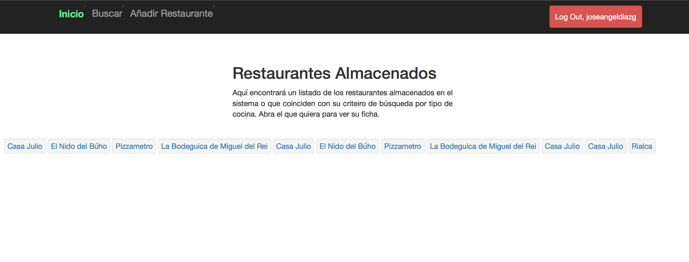
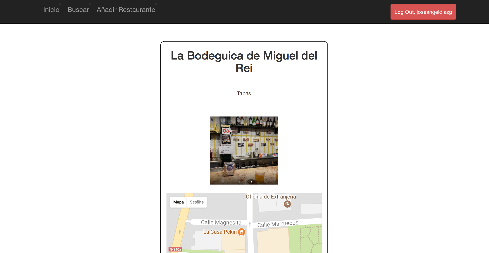
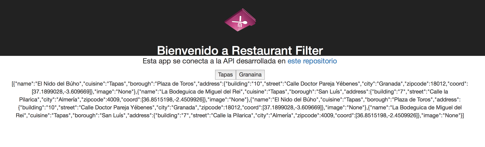

# MII-SSBW

## Introducción

Repositorio para el control de versiones de la asignatura sistemas software basados en web del máster en ingeniería informática de la UGR. 

Durante el desarrollo de la práctica se ha creado una aplicación web que permite añadir y consultar restaurantes.

## Tecnologías usadas

![react][1]  ![python][2] ![mongo][3]  ![django][4]

 [1]: ./images/react.png
 [2]: ./images/python.png
 [3]: ./images/mongo.png
 [4]: ./images/django.jpg

## Flask y Mongo

Antes de pasar a usar el framwork Django se implementó una versión rudimentaria con Flask. En el directorio [mongodb](https://github.com/joseangeldiazg/MII-SSBW/tree/master/mongodb), encontramos un script de carga de datos y creación de la base de datos con el que se práctico previamente antes de comenzar la creación de la aplicación en si. 

## restaurapp

El resultado de la app podemos verlo en la siguientes imagenes. El código fuente está en este [directorio](https://github.com/joseangeldiazg/MII-SSBW/tree/master/django/sitio_web).

Página de inicio:

Detalle de un restaurante:

En esta app, también se implementa una API REST usando [Django Rest Framework](http://www.django-rest-framework.org). Con esta API conectaremos en la siguiente aplicación.  

## restaurantfilter

Usando la API de la app anterior, se ha desarrollado una [Single Page App con React](https://github.com/joseangeldiazg/MII-SSBW/tree/master/restaurantfilter). Esta aplicación se conecta a la API y permite obtener restaruantes y sus datos en función del tipo de cocina. 

El diseño, es básico ya que dependiendo del uso que se le quiera dar los datos en json se formatearían de una u otra manera. 

## Despliegue

Para el despliegue se ha seguido una similitud con una arquitectura microservicios en la que se han divido el servidor web, la app y la base de datos en tres contenedores docker distintos. Para comprobar el despliegue de la misma:

	git clone https://github.com/joseangeldiazg/MII-SSBW.git
	cd MII-SSBW 
	cd despliegue
	docker-compose up
	

## Dependencias

- Django 1.11.1
- pymongo 2.8
- mongoengine 0.13.0
- Pillow 4.1.1
- django-cors-headers
- Requests 2.18.1
- django-registration-redux 1.6
- djangorestframework 3.6.3
- django-rest-framework-mongoengine 3.3.1
